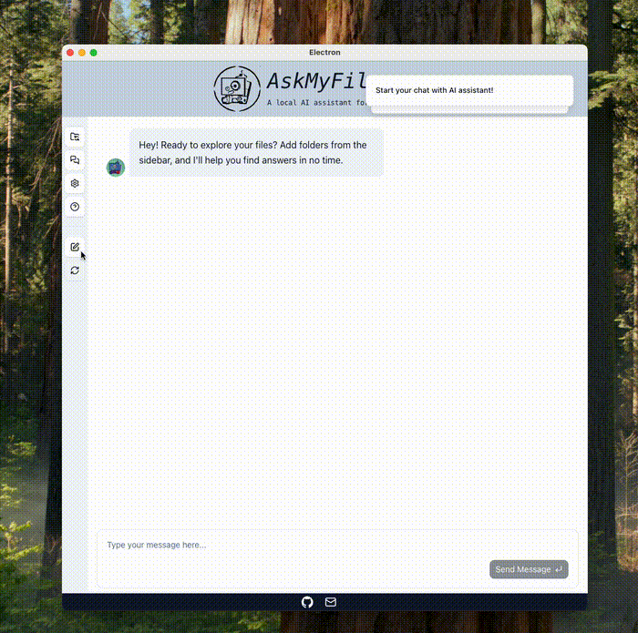
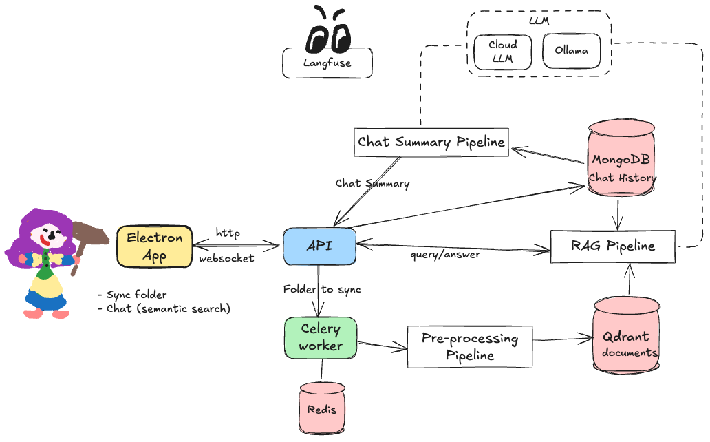

# 🗂️ AskMyFiles

> A cross-platform desktop app to semantically search your local files using AI.

**AskMyFiles** lets you select a folder, index your documents, and ask natural language questions about their contents — choose a cloud LLM, or host everything all offline and locally. Built with Electron and Python for a seamless full-stack experience.

---

## ✨ Features

- 📁 Select a folder and index your files (PDF, TXT, etc.)
- 🔍 Ask natural language questions about your documents
- 🧠 Powered by LLMs for semantic search
- ⚡ Configure for privacy: choose a local LLM so that your data never leaves your machine
- 🖥️ Desktop app built with Electron + FastAPI
- 🔄 Real-time chat interface via WebSockets

---

## 📸 Demo
<p align="center">
  
</p>

---

## 🚀 Getting Started

### Prerequisites

- Node.js and npm for frontend (older version may not work, you'll get prompt when installing :shrug)
- Docker (all backend services are dockerized :smile)

### Installation

```bash
git clone https://github.com/jiehan1029/askmyfiles
cd askmyfiles
```
You'll need to install frontend dependencies in two places: /frontend and /frontend/src/renderer
```bash
cd askmyfiles/frontend
npm run install
cd src/renderer  // <- now inside askmyfiles/frontend/src/renderer
npm run install
```

### Running the App

Start the backend first and then frontend.
```bash
make backend-up
make frontend-up
```
#### Use a Cloud LLM
The current RAG pipeline supports Gemini and HuggingFace. You can get your API token in the corresponding provider, and enter them in app settings to start use.

#### Use a self-hosted LLM in Ollama
If you choose to go 100% local, the backend also supports Ollama. First start Ollama in docker using
```bash
make ollama-up
```
And then configure your model in Ollama at http://localhost:8080.

Now you can select Ollama in the app as the LLM provider.

### Closing the App
`Ctrl + C` to exit the frontend preview, and then stop the backend
```bash
make backend-down
```

## 🧱 Architecture
<p align="center">
  
</p>

Check out [frontend/README.md](/frontend/README.md) and [backend/README.md](/backend/README.md) for more details.

## 📚 Tech Stack
Frontend: Typescript + Electron + React (Vite) + Tailwind CSS

Backend: Python + FastAPI + Haystack + Ollama (LLM)

Async processing: Celery + Redis

Vector DB: Qdrant

Storage: MongoDB with Beanie and Bunnet

Real-time: WebSocket-based chat interface

Observability: Langfuse


## 🛠️ Project Status & Next Steps

The MVP is complete! 🎉

This version proves the concept: local semantic search with a desktop UI (and possibly fully offline). From here, the next steps would include:

- ✅ **Technical Improvements**
  - Pipeline tuning
  - Better error handling (especially around UX)
  - More testing coverage
  - Code refactors and cleanup

- 🚀 **Production Readiness**
  - Packaging & distribution (DMG/EXE)
  - Auto-updates, versioning
  - Observability/logging

- 🌟 **Future Features**
  - Cross-conversation context reference
  - Multi-user support
  - Auto re-sync on file changes
  - More file format support
  - Pluggable LLM providers

That said, I'm currently taking a short break due to time constraints outside of work. I’ll return to it soon — and in the meantime, **feedback is very welcome!**
